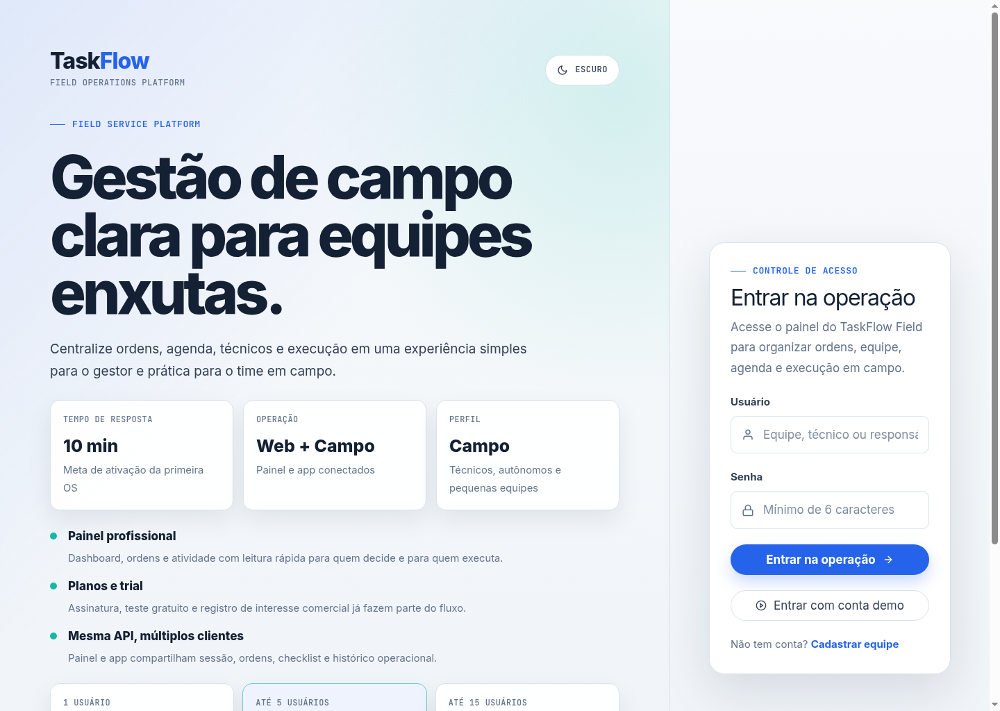
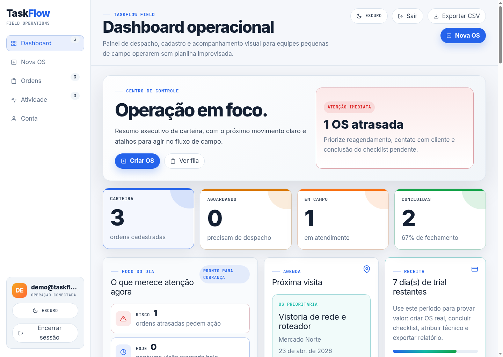
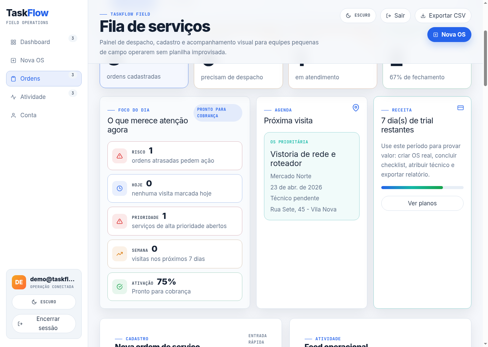
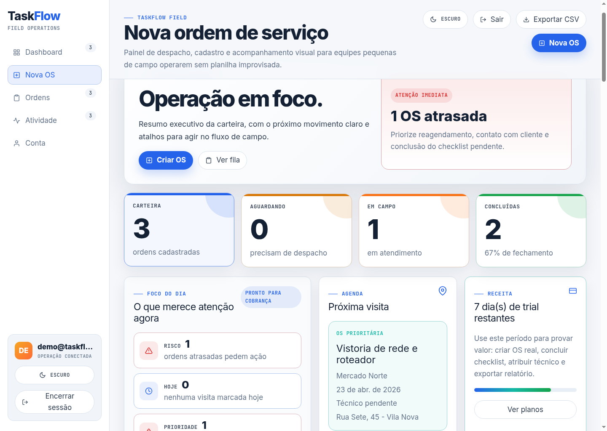
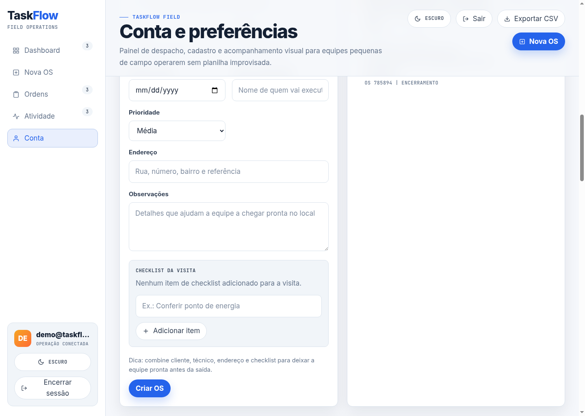

# TaskFlow Field

[English version](README.en.md)

TaskFlow Field é uma plataforma full stack para equipes de serviço em campo controlarem ordens de serviço, agenda, técnicos, checklist e evidências de execução em um painel web e um app mobile conectados à mesma API.

O projeto foi pensado para assistência técnica, manutenção residencial, instalação de internet, câmeras, ar-condicionado, limpeza, vistoria e profissionais autônomos que precisam substituir WhatsApp, planilhas e papel por um fluxo operacional mais claro.

## Demonstração

- Frontend: https://taskflowofc.vercel.app
- Backend: https://taskflow-dlfs.onrender.com
- Mobile: [mobile/README.md](mobile/README.md)
- Estratégia de produto: [docs/product-strategy.md](docs/product-strategy.md)

```text
Usuário demo: demo@taskflow.com
Senha demo: taskflow123
```

## Screenshots

| Login e posicionamento | Dashboard operacional |
| --- | --- |
|  |  |

| Fila de ordens | Cadastro de OS |
| --- | --- |
|  |  |

| Conta e planos | Visual responsivo |
| --- | --- |
|  |  |

As versões prontas para carrossel/post estão em `docs/screenshots/linkedin-*.png`.

## Principais Recursos

- Autenticação com JWT e sessão persistida.
- API REST versionada em `/api/v1`.
- Dashboard web com KPIs, trial, atividade recente e radar de próxima visita.
- CRUD de ordens de serviço com cliente, telefone, endereço, data, prioridade, técnico, observações e checklist.
- Filtros por status, técnico, prioridade, período e busca textual.
- Exportação CSV autenticada das ordens.
- App mobile Expo para técnicos com lista de ordens, detalhes, checklist, mudança de status, comprovante por foto e cache offline.
- Conta demo opcional com dados realistas para apresentação.
- Planos comerciais, trial de 7 dias e registro de intenção de assinatura.
- Design system próprio com tema dark industrial, tema claro e layout responsivo.

## Tecnologias

- Web: React, Vite, React Icons, CSS custom properties.
- Mobile: Expo, React Native, AsyncStorage, SecureStore, ImagePicker, Notifications.
- Backend: Node.js, Express, MongoDB, Mongoose, JWT, bcryptjs.
- Deploy: Vercel, Render e MongoDB Atlas.

## Arquitetura

```text
taskflow/
  backend/       API Express, modelos MongoDB, autenticação e rotas v1
  src/           Painel web React/Vite
  mobile/        App Expo/React Native
  docs/          Estratégia, screenshots e materiais de apresentação
```

## Rodando Localmente

### Backend

```bash
cd backend
cp .env.example .env
npm install
npm run dev
```

### Web

```bash
cp .env.example .env
npm install
npm run dev
```

### Mobile

```bash
cd mobile
cp .env.example .env
npm install
npm run start
```

Também é possível iniciar o mobile pela raiz:

```bash
npm run mobile:lan
```

## Variáveis de Ambiente

### Web

```env
VITE_API_URL=http://localhost:5001/api/v1
VITE_DEMO_ACCOUNT_ENABLED=true
VITE_DEMO_USERNAME=demo@taskflow.com
VITE_DEMO_PASSWORD=taskflow123
```

### Backend

```env
PORT=5001
HOST=127.0.0.1
MONGODB_URI=mongodb://127.0.0.1:27017/taskflow
JWT_SECRET=troque-por-um-segredo-forte
CORS_ORIGINS=http://localhost:5173,http://127.0.0.1:5173,exp://127.0.0.1:8081
DEMO_ACCOUNT_ENABLED=true
DEMO_USERNAME=demo@taskflow.com
DEMO_PASSWORD=taskflow123
DEMO_FULL_NAME=Equipe Demo TaskFlow
```

### Mobile

```env
EXPO_PUBLIC_API_URL=http://SEU_IP_DA_REDE:5001/api/v1
EXPO_PUBLIC_DEMO_ACCOUNT_ENABLED=true
EXPO_PUBLIC_DEMO_USERNAME=demo@taskflow.com
EXPO_PUBLIC_DEMO_PASSWORD=taskflow123
```

## Scripts

```bash
npm run dev          # painel web
npm run build        # build web
npm run lint         # lint geral
npm run mobile:lan   # Expo em LAN
npm run mobile:tunnel
npm run mobile:web   # preview web do app mobile
```

## Decisões de Produto

- O domínio escolhido foi operação de campo porque combina fluxo administrativo, execução mobile e necessidade real de rastreabilidade.
- O MVP cobre o ciclo principal: criar OS, atribuir técnico, acompanhar status, cumprir checklist, registrar evidência e exportar relatório.
- O fluxo comercial já existe em estado inicial: trial, planos, estágio da conta e intenção de checkout.

## Próximos Passos

- Integrar gateway de pagamento.
- Enviar comprovantes para storage externo.
- Adicionar testes automatizados de API e fluxos críticos do frontend.
- Implementar observabilidade, logs estruturados e monitoramento.
- Evoluir permissões por papel, organizações e múltiplas equipes.

## Status

TaskFlow Field está pronto para apresentação como projeto de portfólio full stack e para pilotos controlados com prestadores reais.
